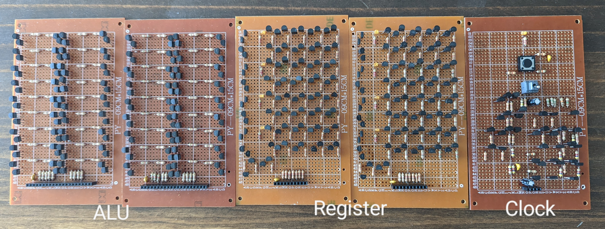

# Computer

TODO: Come up with a better name :)

This repo tracks efforts to create a
[6502](https://en.wikipedia.org/wiki/MOS_Technology_6502) (used in historic
computers, like the Commodore 64 and Apple II) clone using discrete electronic
components. The heart beats using 2N7000 and BS250 MOSFET transistors.

The goal is to run Basic unassisted on this CPU.

See directories:

*   `component_tests`: Arduino `.ino` files for testing board modules.
*   `schematic`: Kicad schematics for board modules / logic units.
*   `simulator`: Software simulator to prototype different modules.

