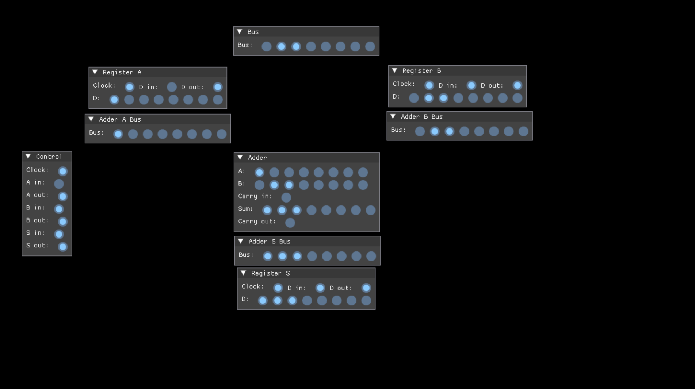

# Simulator

Logic gate simulator. Intended to be used to prototype different modules
of the CPU before building them out.

Uses [SDL2](https://www.libsdl.org/) as a platform abstraction and
[Dear ImGui](https://github.com/ocornut/imgui) for UI.

A bat file is present for building via MSVC / Windows, but there's no Windows
specific code that restricts this from being run on other platforms.
